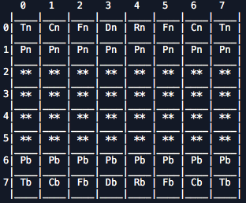
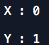
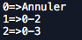
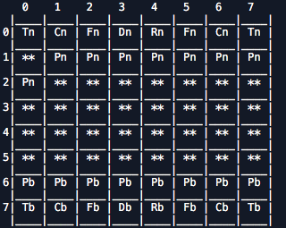

# Project: Polychess  
> Project management to make a chess game. 

## Rules: 

## Goal of the game:

Checkmate, of course, the opponent can give up and you have the chance to win in time.
The King is said to be in check when the square it occupies is controlled by an opponent's piece. The King must therefore MANDATORYLY parry this check.
If the king cannot parry the check, it loses the game, since it is checkmate. 

### Moving parts 

  #### pawn:
  

  #### knight :
  

  #### bishop :
  

  #### Rook :
  

  #### Queen :
  

  #### King :
  

### Special rules

  #### The promotion 
When the pawn reaches the last row of the chessboard, it transforms into another piece of its color (usually a Queen). The pawn cannot transform into a King.

  #### Roque
The King moves two squares, towards one of his Rooks. The Rook jumps over the King to stand next to it (on an adjacent square).
Conditions : 

- Neither the King nor the Rook concerned must have moved during the game, and no piece must separate them.

- The King may not be in check.

- No enemy piece must control the two squares that the king travels to castling..

  #### The catch in passing
  
A pawn may capture an opponent's pawn (from an adjacent file), if it jumps two squares, as if it had advanced only one square. It is said that this pawn takes the enemy pawn "in passing".

### Chess game interface

Above you can see the interface of our chess game. It is declined in console form, with a representation of pieces with a string, for example the string "Tn" represents the black rook, the string "Tb" represents the white rook. 
As you have understood, the first letter defines the type of piece and the second its color.

b: white

n: black

P: pawn

T: rook

C: knight

F: bishop

D: queen

A: king

You will then have to select a piece by entering its (x,y) coordinates: for example if you want to move the piece to (0;1) on the board you will have to type 0 then 1 in the console in this way :
 

Then the program shows you the list of available trips by displaying the possible arrival positions for this room as follows: way :

It will then be necessary to select a move by entering the number corresponding to it, here one chooses to advance it by one square, so one enters the value 1, and the chessboard display is updated :

### Playing a game

You will be able to play against a computer at chess. You will start the game, which will take place turn by turn, the game ends when one of you is checkmate or has a time counter of 0.

### How to use our program? 
  
  To do so, you just have to perform these actions:
  
        - Create a directory on your computer to clone the git repository  
        - clone the project repository locally on your machine: 
            By typing the following command on git bash: git clone https://github.com/TheoBernardin/PolyChess.git.
            By going directly to https://github.com/TheoBernardin/PolyChess.git where you can download it directly 
        - To start the game, run the executable program PolyChess (...\PolyChess\src\dist\menu\menu.exe), then run the program.

        

        
        
       

