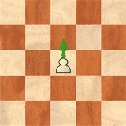
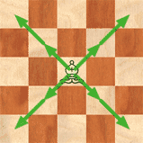
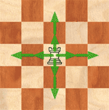
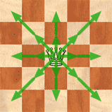
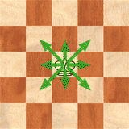

# Projet : Polychess  
> Gestion de projet pour faire un jeu d'échec. 

## Règles : 

### But du jeu :

Faire échec et mat, évidemment, l’adversaire peut abandonner et vous avez la possibilité de gagner au temps.
On dit que le Roi est en échec, lorsque la case qu’il occupe est contrôlée par une pièce adverse. Le Roi doit donc OBLIGATOIREMENT parer cet échec.
Si le Roi ne peut parer l’échec, il perd la partie, puisqu’il est échec et mat.

### Déplacement des pièces 

  #### pion :pawn: :
  

  #### cavalier :knight: :
  

  #### fou :bishop: :
  

  #### tour :
  

  #### dame :
  

  #### roi :
  

### Règles spéciales

  #### La promotion 
Quand le pion atteint la dernière rangée de l’échiquier, il se transforme en une autre pièce de sa couleur (en général une Dame). Le pion ne peut se transformer en Roi.

  #### Roque
Le Roi se décale de deux cases, en direction d’une de ses Tours. La Tour vient sauter par dessus le Roi pour se placer juste à côté(sur une cases adjacente).
Conditions : 

– Ni le Roi, ni la Tour concernés, ne doivent avoir bougé pendant le jeu et aucune pièce ne doit les séparer.

– Le Roi ne peut être en échec.

– Aucune pièce ennemie ne doit contrôler les deux cases que le Roi parcourt pour roquer.

  #### La Prise en passant 
Un pion peut capturer un pion adverse (de colonne adjacente), si celui-ci saute deux cases, comme s’il n’avait avancé que d’une case. On dit que ce pion prend le pion ennemi “en passant”.

### Déroulement d'une partie

Vous pourrez jouer contre un ordinateur aux échecs. Vous commencerez la partie, qui se déroulera tour par tour, la partie se finit lorsque l'un de vous est échec et mat ou que son compteur de temps est a 0.

### Comment utiliser notre programme ? 
  
  Pour se faire il suffit de réaliser ces actions :
  
        - cloner le dépot du projet en local sur votre machine 
        
        
       

