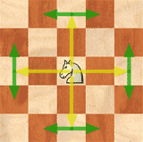

# Projet : Polychess  
> Gestion de projet pour faire un jeu d'échec. 

## Règles : 

### But du jeu :

Faire échec et mat, évidemment, l’adversaire peut abandonner et vous avez la possibilité de gagner au temps.
On dit que le Roi est en échec, lorsque la case qu’il occupe est contrôlée par une pièce adverse. Le Roi doit donc OBLIGATOIREMENT parer cet échec.
Si le Roi ne peut parer l’échec, il perd la partie, puisqu’il est échec et mat.

### Déplacement des pièces 

  pion : 

  cavalier :

  fou :

  tour :

  dame :

  roi :

